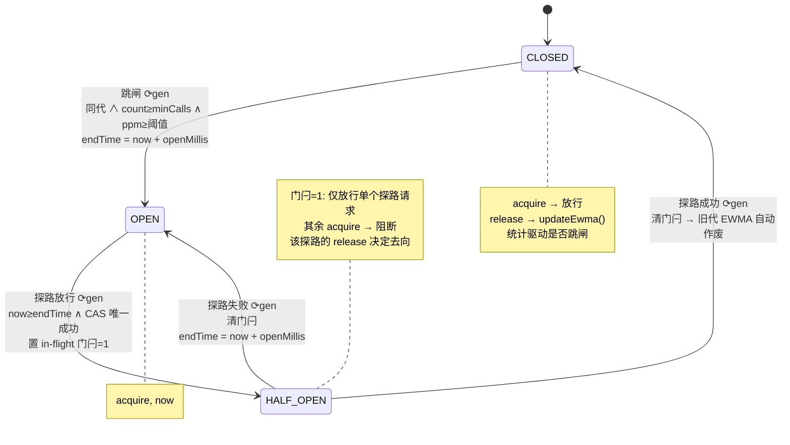

## 1. 背景与目标

在超高并发、微服务及边缘计算场景下，传统流量治理组件（如 Alibaba Sentinel、Hystrix）在提供丰富功能的同时，也引入了显著的资源开销：

1. **GC 压力**：高频创建生命周期上下文对象（如 `Entry`、`Context`）。
2. **CPU 开销**：复杂的责任链模式导致方法栈极深；滑动窗口（Sliding Window）的并发锁竞争与定时调度开销。
3. **内存占用**：大量分配 `MetricBucket` 和数组用于精准的时间窗口统计。

**本设计目标**：构建一个对标 Sentinel 核心能力的熔断限流组件，将单次调用的额外开销从**微秒（μs）级降低至纳秒（ns）级**，实现**零堆内存分配（Zero-Allocation）**、**无锁化（Lock-free）**、**无后台定时线程（治理逻辑侧）**，极大地节省 CPU 和内存资源。

> 注：观测采样与系统探针仍保留极低频后台线程（第 7、10 章），但它们**不在请求关键路径上**，不影响「治理侧无定时器」的结论。

## 2. 核心设计哲学

1. **状态压缩（Bit-Packing）**：利用 64 位 `long` 拼接多个状态属性（如时间戳+令牌数、计数器+错误率），通过单次 CAS 指令实现复合状态的无锁原子更新。
2. **惰性计算（Lazy Evaluation）**：废弃治理侧所有后台定时任务。将状态更新推迟到请求到来的瞬间，结合时间差进行数学推导计算。
3. **降维统计算法**：使用**时间衰减 EWMA**（指数加权移动平均）替代滑动窗口进行错误率统计，内存占用从数十字节降至一个 `long` 的低位。
4. **扁平化执行（Flat Execution）**：废除责任链（Slot Chain）和多态，采用位掩码（Bitmask）标志位与一维数组索引，实现 O(1) 的规则寻址与执行。
5. **【v2 新增】配置 / 状态分离（Config-State Separation）**：把「可热更新的纯参数」与「长生命周期的运行时状态」放在两个独立生命周期的容器里。热更新只替换配置，状态跨版本稳定存活。这是 v2 修复在途请求错乱、并发计数漂移的根基。

## 3. 总体架构设计

系统分为控制面（管理规则）与数据面（流量执行）。数据面完全摒弃面向对象的链式调用，采用基于原始数据类型（Primitive Types）的流线型架构。

### 3.1  配置与状态分离的双槽结构

v1 把 `LazyTokenBucket`、`EwmaCircuitBreaker`（**含运行时状态**）整个塞进 `ResourcePolicy`，热更新时随规则一起被替换，导致在途 release 打到新对象的计数器上。v2 拆成两层：

```
resourceId ──┬──> volatile ResourceConfig[]   CONFIGS   （可 RCU 热换，纯不可变参数）
             └──> final    ResourceState[]     STATES    （长生命周期，永不随规则替换）
```

- **`ResourceConfig`（不可变）**：`mask`、`ratePerMs`、`capacity`、`errThreshold`、`minCalls`、`openMillis`、`ewmaTauMs`、`concurrencyLimit`、`version`。整体替换。
- **`ResourceState`（稳定）**：`AtomicLong bucketState`、`AtomicLong breakerState`、`AtomicLong ewmaState`、`AtomicInteger concurrency[]`（分段）、`LongAdder passCount / blockCount`。**永不因规则变更而重建**。

热更新时只 `CONFIGS.set(resourceId, newConfig)`，`STATES[resourceId]` 原地不动，因此任何在途 release 都作用在正确的稳定状态上（详见第 8 章）。

### 3.2  核心数据结构：64 位 Token

请求通过限流器时不再返回任何对象，而是返回一个 64 位的 `long` 型 Token，贯穿业务调用始末。v1 的位布局占满 64 位，与 `token < 0` 判负冲突，且没有携带桶索引/版本号导致 release 跨线程扣错桶。v2 重新划分：

| 区域 | 位数 | 说明 |
|---|---|---|
| **符号位** | 1 bit (bit 63) | **恒为 0**，为 `token < 0` 判阻断保留（阻断码全为负数） |
| **时间戳** | 37 bit | 相对单调毫秒时间戳（`nanoTime/1M - START`，约 1.1 年），用于计算 RT |
| **配置版本** | 10 bit | acquire 时命中的 `config.version`（低 10 位），release 时校验规则是否已换代 |
| **桶索引** | 4 bit | acquire 时路由到的并发/观测分段索引，release 据此**回到同一段扣减** |
| **规则掩码** | 12 bit | 命中并生效的能力掩码（Bitmask），用于释放资源时精准回滚 |

> 关键点：**桶索引写进 token**，使 release 不再依赖 `threadId`，彻底解决 Reactor/Netty 下 acquire 与 release 跨线程导致的计数漂移（对应第 9 章卖点）。37 位相对时间戳仍远超任何 RT（秒~分钟级），符号位独立保留。
>
> 【C2 扩位】version 由 v1 的 6 位扩至 **10 位**（热更回绕点 64→1024），向 `time` 借 4 位（41→37）。`mask` 12 位不动（位与判定根基，永不借位）。

#### 3.2.1 精确位偏移与编解码

自低位向高位排布，编解码用移位 + 掩码，无分支、无对象：

```
 bit:  63    62 ........ 26   25 ...... 16   15 .. 12   11 ......... 0
      [sign][      time 37     ][ version 10][bucket 4][   mask 12    ]
        0        相对毫秒时间戳        config.version   段索引    生效能力掩码
```

```java
// ---- 位宽（合计 1+37+10+4+12 = 64）----
static final int MASK_BITS    = 12;
static final int BUCKET_BITS  = 4;
static final int VERSION_BITS = 10;
static final int TIME_BITS    = 37;

// ---- 偏移 ----
static final int MASK_SHIFT    = 0;
static final int BUCKET_SHIFT  = 12;
static final int VERSION_SHIFT = 16;
static final int TIME_SHIFT    = 26;

// ---- 掩码 ----
static final long MASK_MASK    = (1L << MASK_BITS)    - 1;   // 0xFFF
static final long BUCKET_MASK  = (1L << BUCKET_BITS)  - 1;   // 0xF
static final long VERSION_MASK = (1L << VERSION_BITS) - 1;   // 0x3FF
static final long TIME_MASK    = (1L << TIME_BITS)    - 1;   // 37 个 1

static long encode(long timeMs, int version, int bucketIdx, int mask) {
    return ((timeMs    & TIME_MASK)    << TIME_SHIFT)
         | ((version   & VERSION_MASK) << VERSION_SHIFT)
         | ((bucketIdx & BUCKET_MASK)  << BUCKET_SHIFT)
         |  (mask      & MASK_MASK);
    // TIME_MASK 只有 37 位，左移 26 后最高落在 bit62，bit63(符号位) 天然恒为 0
}

static long decodeTime   (long t) { return (t >>> TIME_SHIFT)    & TIME_MASK; }
static int  decodeVersion(long t) { return (int)((t >>> VERSION_SHIFT) & VERSION_MASK); }
static int  decodeBucket (long t) { return (int)((t >>> BUCKET_SHIFT)  & BUCKET_MASK); }
static int  decodeMask   (long t) { return (int) (t & MASK_MASK); }
```

**RT 计算用模减法，天然抗时间戳截断/环绕**：

```java
// release 侧算响应时间；即使 time 字段位宽被压缩，只要真实 RT < 2^TIME_BITS ms 就正确
long rtMs = (nowRelMs - decodeTime(token)) & TIME_MASK;
```

这一点是下面「借位」的关键前提：`time` 字段存的是相对时间戳，而 RT = `now - token_time` 在模 `2^TIME_BITS` 下计算，**只要单次真实 RT 小于该字段能表示的时长即正确**，与进程运行了多久无关。而 RT 天然被请求超时（秒~分钟级）封顶，因此 `time` 字段可以被大幅压缩来给 `mask` 让位，环绕根本不会发生在一次调用的生命周期内。

#### 3.2.2 【细化】掩码能力位 > 12 时的借位方案

12 位掩码可表达 12 种独立可组合的治理能力。若能力位不够（如叠加热点参数限流、灰度标记、来源染色等），从 `time` 字段借位。因 RT 只需覆盖单次调用时长，`time` 有大量冗余可让渡：

| time 位宽 | 纯 ms 可表时长 | 让给 mask 的位 | mask 总位 | 是否安全（判据：单次 RT < time 可表时长） |
|---|---|---|---|---|
| 41 | ≈ 69.7 年 | 0 | 12 | 安全（远超任何 RT） |
| 34 | ≈ 198 天 | +7 | 19 | 安全 |
| 27 | ≈ 37.3 小时 | +14 | 26 | 安全（RT < 37h 恒成立） |
| 24 | ≈ 4.66 小时 | +17 | 29 | 安全（RT < 4.6h 恒成立） |
| 20 | ≈ 17.5 分钟 | +21 | 33 | **需确认** RT 上限 < 17min（一般 HTTP/RPC 满足） |

推荐做法：把上表的位宽做成编译期常量，`encode/decode` 引用同一组 `*_BITS`/`*_SHIFT`，改一处即全链路生效。**若掩码需要极多位**（如 > 26），首选把 `time` 压到 27 位（37 小时窗口足以覆盖任何在线 RT），一次性腾出 14 位；仍不够再考虑降低时间戳粒度（如按 10ms 计，`time` 每位翻 10 倍时长）或改用 `mask=32 + time=31` 的对半布局。

> 反模式提醒：不要靠「缩短 mask、把治理能力挤进枚举」来省位——那会退回多态分派。掩码位是 O(1) 位与判定的基础，宁可从 `time` 借。

### 3.3 资源策略映射：数组寻址

- 废弃 `ConcurrentHashMap<String, Resource>`。
- 在系统启动或规则下发时，为每个资源分配一个全局唯一的整型 ID（如 `0` 到 `1023`）。
- 通过 `CONFIGS[resourceId]` 与 `STATES[resourceId]` 进行纳秒级内存寻址。

## 4. 核心模块详细设计

### 4.1 扁平化规则执行引擎（Flat Execution Engine）

通过位掩码定义开启的流量治理能力：

- `0x01`：熔断降级（Circuit Breaking）
- `0x02`：QPS 限流（Rate Limiting）
- `0x04`：并发控制（Concurrency Limiting）

**执行流程**：

1. 全局过载前置短路（第 10 章），命中直接返回 `BLOCK_SYSTEM_OVERLOAD`。
2. 请求到达，传入 `resourceId`，读取 `config = CONFIGS[resourceId]`、`state = STATES[resourceId]`。
3. 提取 `config.mask`，依次进行位与运算（`&`）。若相应位为 `1`，调用对应底层模块，任一失败即返回对应负数阻断码。
4. 全部通过，打包 `[0][time37][version10][bucketIdx4][mask12]` 生成 `long token` 返回。

**阻断码约定（全负数）**：`BLOCK_SYSTEM_OVERLOAD = -1`、`BLOCK_CIRCUIT_BREAKER = -2`、`BLOCK_RATE_LIMITER = -3`、`BLOCK_CONCURRENCY = -4`。

### 4.2  惰性无锁令牌桶限流器（Lazy Token Bucket · 不分段）

替代 Sentinel 基于时间窗口的 QPS 统计与后台漏桶。

> ** 不对令牌桶做 stripe 分段。** 令牌桶持有「全局 QPS 上限」这一不变量，stripe 会破坏该不变量：若各子桶都持满 `capacity/rate`，总放行放大 N 倍；若均摊为 `rate/N`，又会出现「某桶耗尽而其他桶有余令牌」的误杀。这正是 Guava/Sentinel 不 stripe 令牌桶的原因。超高 QPS 下单 `AtomicLong` 的 CAS 重试成本，远小于误杀带来的业务代价。**stripe 只用于可交换求和的观测计数与近似并发数**（4.4、第 7 章）。

#### 4.2.1 状态内存布局（`AtomicLong bucketState`）

| 高 42 位（Time） | 低 22 位（Tokens） |
|---|---|
| 单调递增毫秒时间戳（约可表示 139 年） | 当前可用令牌数（最大约 400 万 QPS） |

#### 4.2.2 核心算法（惰性时间推导）

1. 读取 `bucketState` 并解包为 `Time_last`、`Tokens_current`。
2. 获取当前单调时间 `Time_now`。
3. 计算应补充令牌：`Tokens_add = (Time_now - Time_last) × ratePerMs`（实现：`dtMs × qps / 1000`，**毫秒粒度、向下取整**；并对 `dtMs` 取 `max(0, …)` 兜底非单调异常，且在 `dtMs` 大到足以填满 `capacity` 时饱和返回以避免 long 溢出——见 `LazyTokenBucket.refillTokens`）。
4. 计算最新令牌：`Tokens_new = min(capacity, Tokens_current + Tokens_add)`。
5. 若 `Tokens_new < 1`，CAS 失败路径直接返回阻断（见 4.2.3 抹零对策），否则 `Tokens_new -= 1`。
6. 重新打包并 CAS 更新，失败则自旋重试。

#### 4.2.3 浮点抹零对策：仅生成完整令牌时才推进 Time_last

若 QPS 极低（如 1/s，即 0.001/ms），毫秒级并发下 `Δt × rate` 强转 `long` 被抹零，令牌永不生成。对策：**只有实际生成了 ≥1 个完整令牌时才把 `Time_last` 推进到 `Time_now`**；否则保持 `Time_last` 不变、仅回写扣减后令牌数，让时间差持续累积直至跨过整数门槛。

### 4.3 时间衰减 EWMA 无锁熔断器（Time-Decay EWMA Circuit Breaker）

替代 Sentinel 基于 `LeapArray` 的慢调用/异常比例统计。v2 对 v1 的三处修订：**衰减维度改时间、错误率改定点整数、补齐 release 侧状态迁移与 EWMA 重置**。

#### 4.3.1 数学模型：时间衰减而非样本计数衰减

v1 用 `α ≈ 2/(N+1)`（N 当样本数），会导致低 QPS 资源 EWMA 长期陈旧、高低 QPS 行为不一致。v2 复用令牌桶已计算的时间差，改为时间衰减：

```
α = 1 - exp(-Δt / τ)
EWMA_t = EWMA_{t-1} + α × (X_t - EWMA_{t-1})
```

- `X_t`：当前样本值（成功 = 0，失败 = 1）。
- `τ`（`ewmaTauMs`）：期望半衰期，配置项。`Δt` 越大衰减越充分，天然解决陈旧问题，且符合「惰性时间推导」哲学。
- `Δt` 来源：由 EWMA 自身的 `lastUpdateMs`（见 4.3.2 位布局）与当前单调时间相减得到，**复用同一时钟、无额外 clock 读**。

#### 4.3.1.1 【细化】α 的分段近似（生产必走近似路径）

令 `u = Δt/τ ≥ 0`，`α = 1 - exp(-u)`。逐请求调 `Math.exp` 在纳秒预算下不可接受（HotSpot 上单次 `Math.exp` ~20–40ns，已与整条治理路径同量级）。按 `u` 分三段处理，**热路径命中最廉价的分支**：

| u 区间 | 处理方式 | 依据 / 误差 |
|---|---|---|
| `u ≤ 1/128` | `α ≈ u`（一阶） | 泰勒 `1-e^{-u}=u-u²/2+…`，相对误差 `≈ u/2 < 0.4%` |
| `1/128 < u < 8` | 查表 + 线性插值 | 凸函数插值绝对误差 `≤ STEP²/8 ≈ 3e-5`（ppm 级） |
| `u ≥ 8` | `α = 1` | `e^{-8} < 3.4e-4`，视作完全衰减，误差 `< 0.04%` |

> 高 QPS 下 `Δt` 极小 → `u` 极小 → **绝大多数请求走 `α≈u` 这条无查表、无分支预测失败的路径**；查表仅在稀疏/突发流量（长间隔后来一发）时触发。这与「惰性」哲学天然契合：越冷清的资源，单次衰减越充分，`u≥8` 时直接把 EWMA 重播种为 `X_t`，语义正确。

```java
// 预计算 exp(-u) 查表，u ∈ [0, 8]，512 段
static final int    LUT_SIZE = 512;
static final double U_MAX    = 8.0;
static final double STEP     = U_MAX / LUT_SIZE;          // 0.015625
static final double INV_STEP = 1.0 / STEP;
static final float[] EXP_LUT = new float[LUT_SIZE + 1];
static {
    for (int i = 0; i <= LUT_SIZE; i++) EXP_LUT[i] = (float) Math.exp(-i * STEP);
}

/** 返回 α = 1 - exp(-Δt/τ)，全程无 Math.exp */
static float alpha(long dtMs, double tauMs) {
    double u = dtMs / tauMs;
    if (u <= (1.0 / 128)) return (float) u;              // 一阶，热路径
    if (u >= U_MAX)       return 1.0f;                   // 完全衰减
    double x   = u * INV_STEP;
    int    idx = (int) x;                                // 段内索引
    double f   = x - idx;                                // 线性插值权重
    double e   = EXP_LUT[idx] * (1 - f) + EXP_LUT[idx + 1] * f;
    return (float) (1 - e);
}
```

**为何插值误差落在 ppm 级即可接受**：错误率以 ppm(定点整数) 存储，分辨率本就 `1e-6`。α 的 `3e-5` 绝对误差经 `α·(X_t − EWMA)` 传播，单步最多贡献约 30 ppm 的偏差，且 EWMA 的自平滑会在后续样本中吸收，不累积。若追求更小误差，把 `LUT_SIZE` 提到 1024（误差再降 4 倍）即可，代价仅 4KB。

**整数定点更新**（避免 float 累积与 CAS 抖动）：

```java
// ewma、x 均为 ppm(int, 0..1_000_000)；用 round 避免向零截断的系统性偏差
static int applyDecay(int ewmaPpm, int xPpm, float alpha) {
    return ewmaPpm + Math.round(alpha * (xPpm - ewmaPpm));
}
```

#### 4.3.2  错误率用定点整数（ppm），配 minimumNumberOfCalls 冷启动门槛

> **纠正 v1 的错误论述**：v1 称包装 count 是「防止第一个请求失败导致错误率飙到 100%」——这是**朴素比率 (fails/total) 的问题，不是 EWMA 的问题**。EWMA 从 0 起、首次失败仅得到 `α`（很小），根本不会飙到 100%。EWMA 真正的冷启动风险恰恰相反：**起步偏健康、对突发全失败反应偏慢**。

因此 count 字段的正确用途是 **`minimumNumberOfCalls` 门槛**（样本不足前禁止跳闸，类比 Resilience4j），而非「防飙升」。同时错误率改用 **ppm 定点整数（0–1_000_000）** 存储，避免 `floatToIntBits` 在 CAS 自旋重试下因浮点非结合产生的多线程抖动。

##### 【细化】`AtomicLong ewmaState` 位布局（自包含 Δt 与代际）

时间衰减 EWMA 需要 `lastUpdateMs` 才能算 `Δt`，且需 `generation` 做无锁重置（见 4.3.3）。v1 的 `count32|ppm32` 塞不下这两者。重排为一次 CAS 即可原子更新「代际 + 上次更新时间 + 计数 + 错误率」：

| 高位 → 低位 | 位宽 | 字段 | 说明 |
|---|---|---|---|
| bit 56–63 | 8 | `generation` | 熔断状态每迁移一次 +1（循环）；用于惰性作废陈旧累积 |
| bit 36–55 | 20 | `lastUpdateMs` | 上次更新的相对毫秒时间戳；`Δt = (now − last) & 0xFFFFF` |
| bit 20–35 | 16 | `count` | 自本代（进 CLOSED）以来样本数，**饱和于 65535** |
| bit 0–19 | 20 | `ppm` | 错误率定点值，`2^20 = 1_048_576 ≥ 1_000_000` 恰好容纳 |

设计取舍说明：

- **`generation` 取 8 位（C3 扩位，原 4 位）**：一轮完整代际（CLOSED→OPEN→HALF_OPEN→CLOSED）至少耗时 ≥ `openMillis`，迁移满一代需 ≥ openMillis；8 位（256 代）下撞 ABA 需 ≥ 256×openMillis 量级的停顿，远超任何 GC STW。
- **`lastUpdateMs` 取 20 位（≈17.5 分钟）**：`Δt` 用模减法计算，只要两次更新间隔 < 17.5min 即精确；更长间隔意味着 `u` 早已 ≥ 8（8τ，τ=5s 时即 40s），`α` 直接饱和为 1（EWMA 重播种），间隔具体多长已无意义。即便 17.5min 量级回绕，残余误差也被 EWMA 自平滑吸收。
- **`count` 取 16 位并饱和**：它只服务 `count ≥ minCalls` 这一门槛判断，`minCalls` 通常在数十~数百量级，65535 封顶后判定语义不变，无需更宽。
- **`ppm` 取 20 位**：`0..1_000_000` 恰好落入 20 位，一位不浪费。

>  `count` 明确定义为「**自本代（上次进入 CLOSED）以来累计**」，随状态迁移经 `generation` 自增而**惰性作废**——消除 v1「周期」表述与「无定时器」的自相矛盾，且无需显式清零 CAS。

#### 4.3.3  完整熔断状态机（含 release 侧回写）

##### 【细化】`AtomicLong breakerState` 位布局（携带 generation）

熔断状态用独立 `AtomicLong breakerState` 管理，**同样携带 8 位 `generation`**，与 `ewmaState` 的代际对齐：

| 高位 → 低位 | 位宽 | 字段 | 说明 |
|---|---|---|---|
| bit 62–63 | 2 | `state` | `00`(CLOSED) / `01`(OPEN) / `10`(HALF_OPEN) |
| bit 54–61 | 8 | `generation` | 权威代际；每次状态迁移 +1（循环 256） |
| bit 0–53 | 54 | `endTimeMs` | OPEN 时熔断结束的绝对毫秒时间戳（54 位 ≈5700 年远超所需） |

`generation` 以 `breakerState` 为权威源，`ewmaState` 镜像之。**「进入 CLOSED 需重置 EWMA」不再靠显式清零 CAS，而是靠代际不匹配触发惰性重播种**——更符合无锁与惰性哲学。

##### 状态迁移全图

下图汇总三态、四条迁移、探路门闩与代际惰性重置。**每条迁移边都隐含 `generation +1`**（图中以 `⟳gen` 标注），这是「进入新态即令旧代 EWMA 累积作废」的唯一机制；节点内注记为该态下 acquire/release 的无迁移行为。



读图要点：

- **唯一改 `generation` 的入口是迁移**（`transition()`）。任何一条边触发 `gen++` 后，`ewmaState` 里残留的旧代累积在下一次 `updateEwma()` 被判为「代际不匹配」而重播种——这就是 `HALF_OPEN → CLOSED` 无需显式清 EWMA、却不会被旧错误率立刻二次跳闸的原因（对应下文 ABA 分析）。
- **探路门闩（in-flight latch）** 保证 `OPEN → HALF_OPEN` 后半开态**至多一个在途探路**：由 `OPEN → HALF_OPEN` 的那次 CAS 天然选出唯一线程持有门闩，探路的 `release` 决定回 `CLOSED` 还是退回 `OPEN` 并清门闩。半开期间其余 acquire 一律阻断，避免半开态被打成第二次雪崩。
- **无自环**：CLOSED 态的 acquire 放行、release 更新 EWMA 都不改变状态，故图中不画自环，仅以节点注记表达。

##### acquire 侧（惰性放行）

- `CLOSED`：放行。
- `OPEN`：提取 `endTimeMs`。若 `now ≥ endTime`，CAS 尝试 `OPEN → HALF_OPEN`（`generation +1`）；**CAS 成功的唯一线程放行探路**，其余继续阻断。若 `now < endTime`，直接阻断。
- `HALF_OPEN`：仅允许有限探路（`breakerState` 内可再借一位做 in-flight 门闩，或限定单探路），其余阻断。

##### release 侧状态迁移（v1 完全缺失，v2 补齐）

```java
void release(State st, long token, boolean success, Config cfg, long nowMs) {
    long b = st.breakerState.get();
    int  s = state(b);
    if (s == HALF_OPEN) {
        if (success) transition(st, HALF_OPEN, CLOSED, 0);              // 探路成功 → 恢复
        else         transition(st, HALF_OPEN, OPEN, nowMs + cfg.openMillis); // 失败 → 重熔断
        // 无需显式清 EWMA：transition 已 gen++，下一次 updateEwma 因代际不匹配自动重播种
    } else if (s == CLOSED) {
        updateEwma(st, nowMs, success ? 0 : 1_000_000);                // 见 4.3.1 / 4.3.2
        long e = st.ewmaState.get();
        if (ewmaGen(e) == gen(b)                                        // 同代才可信
                && ewmaCount(e) >= cfg.minCalls
                && ewmaPpm(e)   >= cfg.errThresholdPpm) {
            transition(st, CLOSED, OPEN, nowMs + cfg.openMillis);
        }
    }
}
```

##### 【细化】generation 如何消除 ABA 与「僵尸旧错误率」

核心问题：EWMA 与 breaker 是两个独立 `AtomicLong`，若 `HALF_OPEN → CLOSED` 后不清空 EWMA，旧的高错误率会**立刻再次跳闸，熔断器永远出不来**。而单纯「读旧值 → CAS 写 (0,0)」又存在 ABA / 与并发更新竞态的窗口。用**代际对齐**一并解决：

```java
// 状态迁移：唯一改变 generation 的入口。gen++ 即令旧代所有 EWMA 更新作废
boolean transition(State st, int from, int to, long endTimeMs) {
    for (;;) {
        long cur = st.breakerState.get();
        if (state(cur) != from) return false;                  // 已被他人迁移
        int  gNext = (gen(cur) + 1) & 0xFF;                    // 8 位循环
        long next  = packBreaker(to, gNext, endTimeMs);
        if (st.breakerState.compareAndSet(cur, next)) return true;
    }
}

// EWMA 更新：代际不匹配 → 丢弃陈旧累积，用当前样本重播种（等价于「进 CLOSED 清零」）
void updateEwma(State st, long nowMs, int xPpm) {
    int gNow = gen(st.breakerState.get());                     // 读当前权威代
    for (;;) {
        long cur = st.ewmaState.get();
        long next;
        if (ewmaGen(cur) != gNow) {
            // 发生过状态迁移：陈旧值作废，重播种（count=1, ppm=xPpm, last=now, gen=gNow）
            next = packEwma(gNow, nowMs, 1, xPpm);
        } else {
            long dt   = (nowMs - ewmaLast(cur)) & 0xFFFFF;     // 20 位模减
            float a   = alpha(dt, cfg.ewmaTauMs);              // 见 4.3.1.1
            int   cnt = Math.min(65535, ewmaCount(cur) + 1);   // 饱和
            int   ppm = applyDecay(ewmaPpm(cur), xPpm, a);
            next = packEwma(gNow, nowMs, cnt, ppm);
        }
        if (st.ewmaState.compareAndSet(cur, next)) return;     // CAS 失败自旋
    }
}
```

**为什么 8 位（256 代）足以防 ABA**：陈旧的 EWMA 更新要「误判为同代」，需要在它「读 `gNow`」到「CAS 写入」这段窗口内、`breakerState` 恰好迁移满 256 次回到同一代际值。而一轮完整代际（CLOSED→OPEN→HALF_OPEN→CLOSED）至少耗时 ≥ `openMillis`，迁移满 256 代需 ≥ 256×openMillis 量级的停顿——在真实时钟与状态机节奏下不可能发生（GC STW 是毫秒级）。即便极端下真的撞上，后果也仅是**单个样本被错误归代**，会被 EWMA 的后续自平滑吸收，不产生持久错误。8 位从 `endTimeMs`（54 位仍 ≈5700 年）与 `lastUpdateMs`（20 位，α 在 8τ 已饱和故回绕误差被吸收）各借 4 位，成本几乎为零。（v1 用 4 位/16 代，在 ≥4×openMillis 停顿下即理论撞窗；扩到 8 位是廉价保险。）

> 一句话总结代际机制：**把「两个独立原子量之间的一致性」问题，转化为「更新时校验代际标签」**。迁移只碰 `breakerState`，EWMA 靠标签惰性对齐，全程无跨 `AtomicLong` 的复合原子操作，天然无锁。

### 4.4  并发控制（分段近似）

- 并发数用 `AtomicInteger concurrency[SEG]`（`SEG = 8 或 16`）近似统计，acquire 时对**路由段** `+1`、release 时对**同一段**（从 token 解出的 `bucketIdx`）`-1`。
- **路由改用 `ThreadLocalRandom` probe，而非 `threadId`**：Java 21+ 虚拟线程 id 唯一且短命，`threadId & (SEG-1)` 既无热点局部性、数量也无界，stripe 初衷失效。改用 LongAdder 同款 probe 路由。
- 判定：`sum(concurrency) ≥ concurrencyLimit` 则阻断。sum 是近似值，超高并发下允许轻微过冲，换取无锁。

## 5. API 设计与业务接入指南

业务层完全摒弃 `try-with-resources` 和对象创建，采用极致轻量的过程式调用。**token 已携带版本号与桶索引，release 无需感知线程。**

```java
// 系统初始化阶段：注册资源并获取全局 ID
int RESOURCE_ORDER_CREATE = ResourceManager.register(
    new PolicyBuilder()
        .enableRateLimit(1000)           // ratePerMs / capacity 由此推导
        .enableCircuitBreaker(0.5f)      // errThreshold
        .minimumCalls(20)                // v2：冷启动门槛
        .ewmaHalfLife(5000)              // v2：EWMA 半衰期 ms
        .build());

public void createOrder() {
    long token = FlatExecutionEngine.tryAcquire(RESOURCE_ORDER_CREATE);

    if (token < 0) {   // 符号位保留，负数即阻断
        switch ((int) token) {
            case FlatExecutionEngine.BLOCK_RATE_LIMITER:  throw new RateLimitException("被限流");
            case FlatExecutionEngine.BLOCK_CONCURRENCY:   throw new ConcurrencyLimitException("并发超限");
            case FlatExecutionEngine.BLOCK_SYSTEM_OVERLOAD: throw new SystemOverloadException("系统过载");
            default:                                       throw new CircuitBreakerException("被熔断");
        }
    }

    boolean success = false;
    try {
        doCreateOrder();
        success = true;
    } finally {
        // token 内含 version + bucketIdx + mask：
        // 高位算 RT、按桶回滚并发计数、按掩码上报 EWMA，全程与执行线程无关
        FlatExecutionEngine.release(RESOURCE_ORDER_CREATE, token, success);
    }
}
```

## 6. 工程落地关键防坑指南（Pitfalls & Best Practices）

### 6.1  CAS 竞争风暴与分段的正确边界

在单节点超高 QPS（> 50,000）下，多线程疯狂 CAS 同一 `AtomicLong` 会导致 Cache Line 颠簸。**但分段必须区分对象语义**：

- **可 stripe（无全局不变量、可交换求和）**：观测计数（`LongAdder`）、并发近似数（4.4）。用 `ThreadLocalRandom` probe 路由，索引写入 token 供 release 回段。
- **不可 stripe（有全局不变量）**：令牌桶（全局 QPS 上限）、熔断状态机。保留单 `AtomicLong` + 自旋。
- 对令牌桶/breakerState/ewmaState 的 `AtomicLong` 施加 `@Contended` 填充隔离伪共享，比错误 stripe 更安全。**【关键陷阱】`@jdk.internal.vm.annotation.Contended` 在用户类上默认被 JVM 忽略**——必须启动时加 `-XX:-RestrictContended`（`RestrictContended` 默认 true，仅对 bootstrap 类生效）。实测 JDK 21：未加该 flag 时三个热点 long 的字段偏移为 12/16/20（4 字节紧挨、共处 cache line，伪共享照样发生）；加上后为 280/412/544（各占独立 cache line）。故**生产部署的 JVM 必须带 `-XX:-RestrictContended`**，否则本设计的反伪共享填充完全失效（仅 `--add-exports` 让代码能编译/引用注解，并不让 JVM 真正布局填充）。项目构建已为 test/jmh 注入该 flag，并由 `ContendedPaddingGuardTest` 守卫。

### 6.2 浮点精度与时间流逝抹零

见 4.2.3：仅生成完整令牌时才推进 `Time_last`，让时间差持续累积。

### 6.3 时间倒退与系统时钟跳变

全面使用 `System.nanoTime() / 1_000_000` 获得相对单调时间戳。启动时记录一次 `START = System.nanoTime() / 1_000_000`，后续统一使用 `Time_now = (System.nanoTime()/1_000_000) - START`，同时缩小数值范围以适配 token 的 37 位时间戳字段。

### 6.4 ABA 与在途 release 的版本校验

release 时从 token 解出 `version`，与当前 `CONFIGS[resourceId].version`（低 10 位）比对：

- 版本一致：正常按当前配置上报。
- 版本已变（热更新发生在 acquire 与 release 之间）：**并发计数照常按 `bucketIdx` 回滚**（作用在稳定的 `STATES` 上，永远正确），EWMA 上报可选择跳过或降权，避免旧阈值语义污染新配置。

## 7.  监控与指标上报（Observability）

因丢弃 `LeapArray` 和 `MetricBucket`，无法提供 Sentinel 式精确到秒的实时面板，采用轻量方案：

1. **单调累加计数器**：`STATES` 中的 `LongAdder passCount / blockCount` **只增不清**，不在核心自旋逻辑内，仅 release 末尾异步递增。
2. ** scraper 端算差值，不调用 `reset()`**：`LongAdder.reset()` 与并发 `add()` 存在竞态，`sum()` 到 `reset()` 之间的增量会丢。改为后台低频（如 5s）守护线程读取当前 `sum()`，与自身保存的 `lastValue` 相减得增量，推送 Prometheus——这正好契合 counter 的单调语义。
3. **EWMA 暴露**：将熔断器 EWMA 的 ppm 值除以 1e6 暴露为 Gauge，反映实时健康度。

## 8.  动态规则与热更新机制（RCU Hot-Reloading）

在微服务场景中，规则动态下发（Nacos / Apollo / ETCD）是刚需。v2 借助**配置/状态分离**，让 RCU 只换配置、状态跨版本稳定，从根上消除在途请求错乱。

### 8.1 只有配置不可变，状态长生

v1 把含状态的 `LazyTokenBucket`/`EwmaCircuitBreaker` 整体替换，导致在途 release 打到新计数器、新并发计数变负、旧计数永不归零。v2 明确：

- **`ResourceConfig` 不可变**：规则变更时 `new` 一个全新配置对象（纯参数），`version` 自增。
- **`ResourceState` 永不随规则替换**：令牌桶 long、breakerState、ewmaState、并发段、观测计数挂在跨版本稳定的槽位。

### 8.2 原子指针替换（Atomic Swap）

`CONFIGS` 用 `volatile ResourceConfig[]`（整体引用替换）或 `AtomicReferenceArray<ResourceConfig>`。

**热更新流程**：

1. 监听配置中心变更事件。
2. 后台线程根据新规则 `new` 一个 `ResourceConfig`（仅纯参数，`version = old.version + 1`）。
3. `CONFIGS.set(resourceId, newConfig)` 一次性替换。`STATES[resourceId]` **原地不动**。
4. 在途请求的 release 通过 token 内 `version` 感知换代（6.4），并发回滚始终作用在稳定 state 上，天然正确。
5. 旧 `ResourceConfig` 失去引用，下次 GC 平滑回收；因无任何后台调度挂载，不会内存泄漏或「僵尸限流」。

> 参数语义变化（如 `capacity` 调大）如何作用于既有令牌桶 state？令牌桶算法每次都读 `config.capacity` 做 `min` 截断，故新容量在下一次 acquire 即生效，无需迁移 state。

## 9. 异步与响应式框架的天然适配（Async & Reactive Native Adaptation）

Sentinel 的历史包袱是上下文管理依赖 `ThreadLocal`，在 WebFlux/Netty/Vert.x 下会上下文丢失。本方案把生命周期上下文全部压进 64 位 token，接入响应式框架极度简单——**且 v2 让这个卖点真正成立**：token 内含 `bucketIdx`，release 落在正确的并发段，不再因 Reactor 线程切换而扣错桶。

```java
public Mono<String> reactiveCall() {
    return Mono.defer(() -> {
        long token = FlatExecutionEngine.tryAcquire(RESOURCE_ID);  // 无 ThreadLocal 绑定
        if (token < 0) return Mono.error(new RateLimitException("Blocked"));

        return doRemoteCall()
            // release 从 token 解出 version + bucketIdx，与执行它的 Reactor 线程无关
            .doOnSuccess(res -> FlatExecutionEngine.release(RESOURCE_ID, token, true))
            .doOnError(err  -> FlatExecutionEngine.release(RESOURCE_ID, token, false));
    });
}
```

*优势*：无论底层 Reactor 线程池如何切换，`token` 只是被闭包捕获的普通局部变量，绝不会上下文错乱、计数漂移或内存泄漏。

## 10.  系统级自适应过载保护（Graded Load Shedding）

Sentinel 的 SystemRule 依赖后台采集 CPU、Load。本方案保留轻量采集，但拦截链上贯彻扁平化，并把 v1 的全有/全无单 `boolean` 改为**分级概率丢弃 + 迟滞**，避免放行震荡。

### 10.1 分级过载水位与迟滞

后台低频探针（每 1s 采集 CPU）维护一个 `volatile int SHED_PERMILLE`（丢弃千分比，0–1000）：

- CPU 分级：`< enterLow` → 0；`enterLow..enterMid` → 200；`enterMid..enterHigh` → 500；`> enterHigh` → 800。
- **迟滞（hysteresis）**：进入某档的阈值高于退出该档的阈值（如进 500 需 CPU>85% 持续 3s，退回 200 需 CPU<75%），避免临界抖动。

### 10.2 前置概率短路

```java
public static long tryAcquire(int resourceId) {
    int shed = SHED_PERMILLE;   // volatile 读
    if (shed > 0 && ThreadLocalRandom.current().nextInt(1000) < shed) {
        return BLOCK_SYSTEM_OVERLOAD;   // O(1) 概率拦截，不进入资源策略
    }
    // ... 后续资源级校验
}
```

> 相比 v1 全量拒绝，分级丢弃在过载边缘平滑降载，避免「全放行→全拒绝→全放行」的自激振荡。

## 11. 演进路线与总结

### 11.1 方案适用场景边界

本方案是典型的「用空间（功能丰富度）换时间（极限性能）」架构，适用于：

- **边缘计算网关 / API Gateway**：需要极高吞吐与极低延迟。
- **Service Mesh Sidecar**：资源极其受限，不能频繁触发 GC。
- **底层基础中间件**：数据库连接池、RPC 框架内置限流，不允许引入庞大第三方依赖。

**不适用场景**：

- 需要复杂调用链路分析（如按 `origin` 细粒度限流）。
- 需要精准秒级集群 QPS 同步（本方案侧重单机极速，集群限流需外置 Redis/Token Server，会打破无锁设计）。
### 11.2 最终总结

优秀的架构不只是堆叠设计模式。Sentinel 是大而全的优秀生态产品，但在追求极限性能的细分场景下，过度抽象即是原罪。本设计通过**数据降维（时间衰减 EWMA 代替 Sliding Window）**、**状态压缩（`long` 承载状态+时间+掩码）**、**消除抽象（数组寻址与位运算代替多态责任链）**、**惰性求值（取消治理侧后台线程）**，将一次流量拦截压缩到纳秒级。

而 v2 的核心教训是：**极致性能不能以牺牲正确性为代价**。v1 六处缺陷的共同根因，是把「配置」与「运行时状态」耦合进同一可替换对象、并假设 acquire 与 release 同线程。把这两个假设拆开——config 可换 / state 稳定、生命周期信息全压进 token——正确性与性能才能同时成立。这既是性能的胜利，更是对 JVM 内存模型与并发原语深度理解的工程实践。

