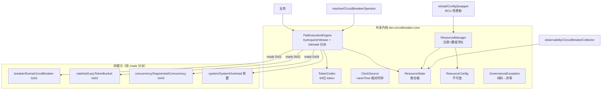

# 01 系统概览（System Overview）

> 来源：`src/main/java/dev/circuitbreaker/**` · 单一 Domain · Java 21 · Gradle 9.2.1
> 生成日期：2026-07-30 · 当前 HEAD：`dfead23`

## 1. 项目定位

`circuit-breaker` 是一个**纳秒级、零堆分配、无锁化**的 JVM 流量治理库（熔断 / 限流 / 并发控制 / 系统过载），对标 Alibaba Sentinel / Hystrix 的核心能力，以极致性能为第一性原理，适合网关、Service Mesh Sidecar、RPC 框架、连接池等高并发/资源受限场景。业务用户为**集成该库的中间件/业务开发工程师**。

## 2. 技术栈

| 维度 | 选型 | 证据 |
|---|---|---|
| 语言/运行时 | Java 21（LTS） | `build.gradle.kts: JavaLanguageVersion.of(21)` |
| 构建 | Gradle 9.2.1（Kotlin DSL，单工程） | `settings.gradle.kts`、`gradle/wrapper/gradle-wrapper.properties` |
| 核心依赖 | **零三方依赖** | `build.gradle.kts`（core 无 implementation 三方） |
| 可选依赖 | reactor-core 3.6.10、prometheus simpleclient 0.16.0 | `build.gradle.kts` |
| 基准 | JMH 1.37 | `build.gradle.kts`（jmh source set） |
| 测试 | JUnit 5.10.2 + AssertJ 3.26.3 + ArchUnit 1.3.0 | `build.gradle.kts` |
| 覆盖率 | JaCoCo（LINE 93.4% / BRANCH 84.3% / METHOD 98.6%） | `build.gradle.kts` jacoco |
| CI | GitHub Actions（JDK 21 / Linux） | `.github/workflows/ci.yml` |

## 3. 架构总览



## 4. 六条不变量（NON-NEGOTIABLE）

| # | 不变量 | 落地证据 |
|---|---|---|
| 1 | 纳秒级开销 | `FlatExecutionEngine.tryAcquire`（JMH ~56ns/op） |
| 2 | 零堆分配（热路径） | 64 位 long token，`TokenCodec`；JMH `gc.count≈0` |
| 3 | 无锁（单 AtomicLong CAS） | `ResourceState` AtomicLong 字段；`@Contended` 待办 |
| 4 | 无治理侧后台定时线程 | 惰性时间推导；仅 `SystemOverload` 低频探针且非热路径 |
| 5 | 配置/状态分离 | `CONFIGS`(AtomicReferenceArray) / `STATES`(final[]) |
| 6 | 自描述 token | token 携 version+bucketIdx；release 线程无关 |

## 5. 构建与运行
```bash
./gradlew build                    # 编译 + 45 测试
./gradlew jacocoTestReport         # 覆盖率
./gradlew jmh                      # JMH 性能 + gc profiler
```

## 6. 模块边界
单一工程、单包族 `dev.circuitbreaker.{core,reactive,observability}` + `benchmarks`（JMH 源集）。详见 `02_CORE_MODULES.md`。

## 7. 相关文档
- 详细模块：`02_CORE_MODULES.md` · API：`03_API_INTERFACE.md` · 数据模型：`04_DATA_MODEL.md`
- 配置：`05_CONFIG_MANAGEMENT.md` · 工具/可观测：`06_UTILS_LIBRARIES.md`
- 设计来源：`docs/brd/design.md`、`memory/constitution.md`
