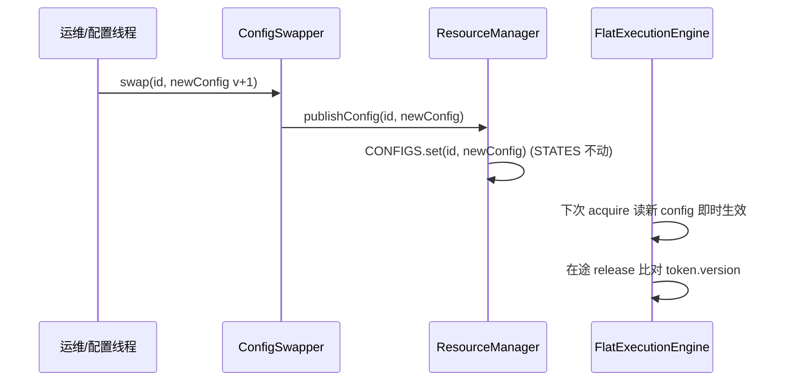

# 05 配置管理（Config Management）

> 来源：`src/main/java/dev/circuitbreaker/core/PolicyBuilder.java`、`ResourceConfig.java`、`ResourceManager.java`、`reload/ConfigSwapper.java`
> 本库无外部配置文件（非 application.properties 型）；"配置"指**运行时 ResourceConfig（策略参数）**。

## 1. 配置项清单（PolicyBuilder → ResourceConfig）

| 参数 | Builder 方法 | 类型/范围 | 默认 | 关联能力/规则 | 校验 |
|---|---|---|---|---|---|
| `mask` | enableRateLimit/enableCircuitBreaker/enableConcurrency 组合 | int 0x01/0x02/0x04 | 0 | bitmask 分派 | — |
| `qps` | `enableRateLimit(long qps)` | long ∈ (0, 4_194_303] | — | 限流（→capacity=qps 突发） | >0 且 ≤22位上限 |
| `capacity` | （=qps 派生） | long ≤ 4_194_303 | =qps | 令牌桶突发 | 随 qps |
| `errThresholdPpm` | `enableCircuitBreaker(float)` | int ∈ (0, 1_000_000] | — | 熔断错误率阈值 | errThreshold∈(0,1] |
| `minCalls` | `minimumCalls(int)` | int > 0 | 1 | 熔断冷启动门槛 | >0 |
| `openMillis` | `openMillis(long)` | long > 0 | 5_000 | 熔断开启/探路截止时长 | >0 |
| `ewmaTauMs` | `ewmaHalfLife(long)` | long > 0 | 5_000 | EWMA 衰减半衰期 τ | >0 |
| `concurrencyLimit` | `enableConcurrency(int)` | int > 0 | — | 并发上限 | >0 |
| `version` | （build 设 1，热更 +1） | int（低6位进 token） | 1 | 配置版本 | — |

**校验**：`PolicyBuilder.build()` 对违例抛 `IllegalArgumentException`（详见 `03_API_INTERFACE.md` API-004）。直接 `new ResourceConfig(...)` 不经校验（内部/测试用）。

## 2. 配置生命周期

### 2.1 注册（一次性）
`ResourceManager.register(name, config)`（`ResourceManager.java:19`）：
1. 分配 resourceId（0..1023，超限抛 IllegalStateException）。
2. `STATES[id] = new ResourceState()`（seed 令牌桶至 capacity）。
3. `CONFIGS.set(id, config)`（AtomicReferenceArray 安全发布）。

### 2.2 应用（每次 acquire）
`FlatExecutionEngine.tryAcquire` 读 `CONFIGS.get(id)` 取最新 config；`capacity`/`qps`/阈值等在下一次 acquire 即时生效（无需迁移 state）。

### 2.3 热更新（RCU）
`ConfigSwapper.swap(id, newConfig)`（调用方 version+1）→ `ResourceManager.publishConfig`（`:51`）→ `CONFIGS.set`。`STATES[id]` **不动**（跨版本稳定）。在途 release 经 token.version 感知换代（不匹配时并发照常回滚、EWMA 降权/跳过）。

## 3. 配置语义变更的影响
- `qps`/`capacity` 调大：下次 acquire 即生效（桶按新 capacity min 截断）。
- `errThreshold`/`minCalls`/`τ` 变更：影响后续 EWMA 上报与跳闸判定；代际机制保证恢复后不被旧阈值污染。
- version 溢出：6 位，64 次热更后回绕（已知局限 A5，请求寿命远小于此）。

## 4. 配置来源（v1 范围）
v1 仅**编程式 API**（PolicyBuilder / ConfigSwapper）。配置中心监听器（Nacos/Apollo/ETCD）**排除在 v1 之外**（constitution 已记录）——后续可在此层之上外挂监听 → 调 `swap`。
