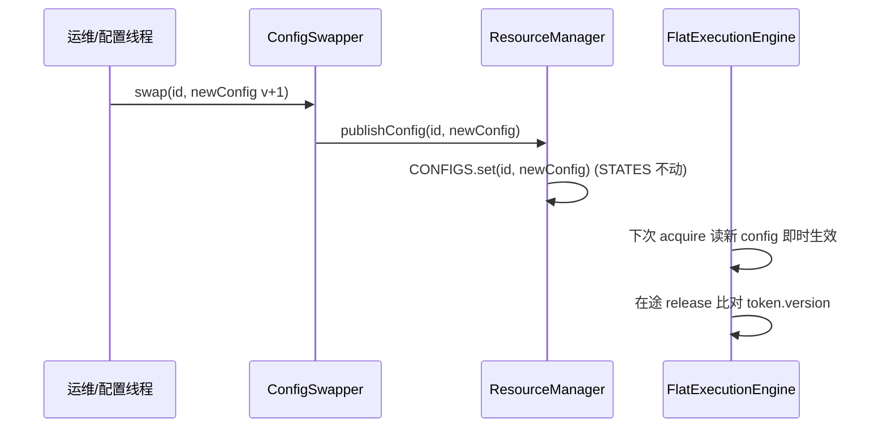

# 05 配置管理（Config Management）

> 来源：`src/main/java/dev/circuitbreaker/core/PolicyBuilder.java`、`ResourceConfig.java`、`ResourceManager.java`、`reload/ConfigSwapper.java`、`PolicySpec.java`
> 本库无外部配置文件（非 application.properties 型）；"配置"指**运行时 ResourceConfig（策略参数）**。

## 1. 配置项清单（PolicyBuilder → ResourceConfig）

| 参数 | Builder 方法 | 类型/范围 | 默认 | 关联能力/规则 | 校验 |
|---|---|---|---|---|---|
| `mask` | enableRateLimit/enableCircuitBreaker/enableConcurrency 组合 | int 0x01/0x02/0x04 | 0 | bitmask 分派 | — |
| `qps` | `enableRateLimit(long qps)` | long ∈ (0, 4_194_303] | — | 限流（→capacity=qps 突发） | >0 且 ≤22位上限 |
| `capacity` | （=qps 派生） | long ≤ 4_194_303 | =qps | 令牌桶突发 | 随 qps |
| `errThresholdPpm` | `enableCircuitBreaker(float)` | int ∈ (0, 1_000_000] | — | 熔断错误率阈值 | errThreshold∈(0,1] |
| `minCalls` | `minimumCalls(int)` | int > 0 | 1 | 熔断冷启动门槛 | >0 |
| `openMillis` | `openMillis(long)` | long > 0 | 5_000 | 熔断开启/探路截止时长 | >0 |
| `ewmaTauMs` | `ewmaHalfLife(long)` | long > 0 | 5_000 | EWMA 衰减半衰期 τ | >0 |
| `concurrencyLimit` | `enableConcurrency(int)` | int > 0 | — | 并发上限 | >0 |
| `version` | （build 设 1，热更 +1） | int（低 10 位进 token） | 1 | 配置版本 | — |

**单字段校验**：`PolicyBuilder.build()` 对每个字段单独校验（errThreshold∈(0,1]、τ>0、qps∈(0,4_194_303]、minCalls>0、concurrency>0、openMillis>0），违例抛 `IllegalArgumentException`（详见 `03_API_INTERFACE.md` API-004）。直接 `new ResourceConfig(...)` 不经校验（内部/测试用）。

**跨参数 SLA 校验（opt-in）**：附 `.sla(SlaFacts)` 后，`build()` 额外校验参数间的 SLA 不变量（S1–S5，见 §6）；不附则跳过，零行为变化。

## 2. 配置生命周期

### 2.1 注册（一次性）
`ResourceManager.register(config)`（`ResourceManager.java:20`）：
1. 分配 resourceId（0..1023，超限抛 IllegalStateException）。
2. `STATES[id] = new ResourceState()`（seed 令牌桶至 capacity）。
3. `CONFIGS.set(id, config)`（AtomicReferenceArray 安全发布）。

### 2.2 应用（每次 acquire）
`FlatExecutionEngine.tryAcquire` 读 `CONFIGS.get(id)` 取最新 config；`capacity`/`qps`/阈值等在下一次 acquire 即时生效（无需迁移 state）。

### 2.3 热更新（RCU）
`ConfigSwapper.swap(id, newConfig)`（调用方 version+1）→ `ResourceManager.publishConfig`（`:51`）→ `CONFIGS.set`。`STATES[id]` **不动**（跨版本稳定）。在途 release 经 token.version 感知换代（不匹配时并发照常回滚、EWMA 降权/跳过）。



## 3. 配置语义变更的影响
- `qps`/`capacity` 调大：下次 acquire 即生效（桶按新 capacity min 截断）。
- `errThreshold`/`minCalls`/`τ` 变更：影响后续 EWMA 上报与跳闸判定；代际机制保证恢复后不被旧阈值污染。
- version 溢出：10 位，1024 次热更后回绕（已知局限 A5，请求寿命远小于此；C2 已由 v1 的 6 位/64 次扩位）。

## 4. 配置来源（v1 范围）
v1 仅**编程式 API**（PolicyBuilder / ConfigSwapper）。配置中心监听器（Nacos/Apollo/ETCD）**排除在 v1 之外**（constitution 已记录）——后续可在此层之上外挂监听 → 调 `swap`。

## 5. 从 SLA 推导参数（SLA → ResourceConfig）

业务方通常只握有服务提供方 SLA 中的几个数：**TPS 上限**、**RT（p50/p99）**、**可用性**。下表把它们换算为 `ResourceConfig` 参数。

| 参数 | SLA 输入 | 换算公式 | 经验 / 约束 |
|---|---|---|---|
| `qps` | TPS 上限 | `qps = SLA_TPS × 安全系数(0.7~0.9)` | 留余量避免踩下游硬限；≤4_194_303 |
| `capacity` | （突发容忍）| 当前 API 强制 `= qps` | `PolicyBuilder` 写死，无独立旋钮 |
| `concurrencyLimit` | RT | `≈ qps × p99RT(秒)`（Little's Law）| 用 p99 不误杀慢请求；avg 可作下限参考 |
| `errThresholdPpm` | 可用性 | `≈ max(10 × 稳态错误率, 业务容忍)` | 稳态错误率 = `(1 − 可用性) × 1e6`；阈值高于其一个量级 |
| `minCalls` | TPS | 20~100；低 TPS 取小值 | 约束 `minCalls / qps(秒) ≪ τ` |
| `ewmaTauMs` | 观察窗口 | `τ ≈ 想观察的窗口 × 1~2` | 默认 5000；真半衰期 ≈ `τ × 0.693` |
| `openMillis` | 下游恢复时间 | `≈ 下游故障平均恢复时间` | 默认 5000；常见 5~60s |

**示例**：SLA = 2000 TPS / p99 100ms / 99.9% 可用（稳态错误率 1000ppm）→

```java
new PolicyBuilder()
    .enableRateLimit(1600)          // 2000 × 0.8
    .enableCircuitBreaker(0.10f)     // 10% = 100000ppm ≫ 1000ppm
    .minimumCalls(50)
    .ewmaHalfLife(5_000)
    .openMillis(10_000)
    .enableConcurrency(160)          // 1600 × 0.1s（p99）
    .build();
```

**配后自检（5 条不变量）**——已由 `PolicySpec` 编码（§6）：①`qps < SLA_TPS`（余量）；②`concurrencyLimit ≥ qps × p99RT`（不误杀）；③`minCalls / qps(秒) ≪ τ`（样本可攒齐）；④`errThresholdPpm ≫ 稳态错误率`（阈值高于正常）；⑤`minCalls ≥ 3`（冷启动地板，防 1~2 次早期失败误跳闸）。

## 6. 构造期 SLA 校验（`PolicySpec`）

`PolicySpec`（`PolicySpec.java:33`）是**离线跨参数校验器**：把 `ResourceConfig` 与 SLA 事实（`SlaFacts: slaTps/avgRtMs/p99RtMs/steadyErrorRatePpm`，`:43`）对照，检查参数**之间**的关系不变量——这是 `PolicyBuilder.build()` 的单字段校验查不到的。**仅在注册/热更新期调用，绝不在请求热路径。**

**opt-in 集成**：`PolicyBuilder.sla(SlaFacts)`（`PolicyBuilder.java:42`）附上 SLA 事实后，`build()` 末尾 `enforceSlaInvariants`（`:78`）自动跑校验；**不调 `.sla()` 则完全跳过**，零行为变化（向后兼容）。

**5 条不变量**（按 `cfg.mask` 分支，未启用的能力跳过）：

| 规则 | 判定 | ERROR / WARN 边界 |
|---|---|---|
| **S1** 余量（`checkHeadroom:111`）| `qps < slaTps` | `qps≥slaTps`→ERROR；`>95% slaTps`→WARN |
| **S2** Little's Law（`checkConcurrency:126`）| `concurrency ≥ qps×RT` | <`qps×avgRT`→ERROR；<`qps×p99RT`→WARN |
| **S3** 样本可攒齐（`checkSampleAccumulation:144`）| `minCalls/TPS ≪ τ` | 攒样本时间≥τ→ERROR；>τ×10%→WARN |
| **S4** 跳闸余量（`checkTripMargin:167`）| `errThreshold ≫ 稳态错误率` | ≤稳态→ERROR；<10×稳态→WARN |
| **S5** 冷启动地板（`checkMinCallsFloor:184`）| `minCalls ≥ 3` | `<3`→ERROR（1~2 次早期失败即跳闸）；`<10`→WARN（地板过薄） |

> S3 的 TPS 上界：开限流用 `cfg.qps`（本服务真实上限），否则退化为 `slaTps`（下游上限，乐观估计）。

**ERROR/WARN 语义**：只有 **ERROR 阻断 `build()`**（抛 `IllegalArgumentException`，消息含全部 findings）；**WARN 不阻断**（"是否容忍 p99 慢请求被并发门挡"是业务策略，不该硬拦）。想看完整诊断单独调 `PolicySpec.check(cfg, sla)`（`:86`）或 `isValid(cfg, sla)`（`:103`）。

```java
PolicySpec.SlaFacts sla = new PolicySpec.SlaFacts(2000, 50, 100, 1000);
ResourceConfig cfg = new PolicyBuilder()
    .enableRateLimit(1600).enableCircuitBreaker(0.10f)
    .minimumCalls(50).ewmaHalfLife(5_000).enableConcurrency(160)
    .sla(sla)        // opt-in：build() 硬卡 S1–S5 的 ERROR
    .build();        // concurrency 漏填到 80 以下（S2 ERROR）在此直接抛异常
```
